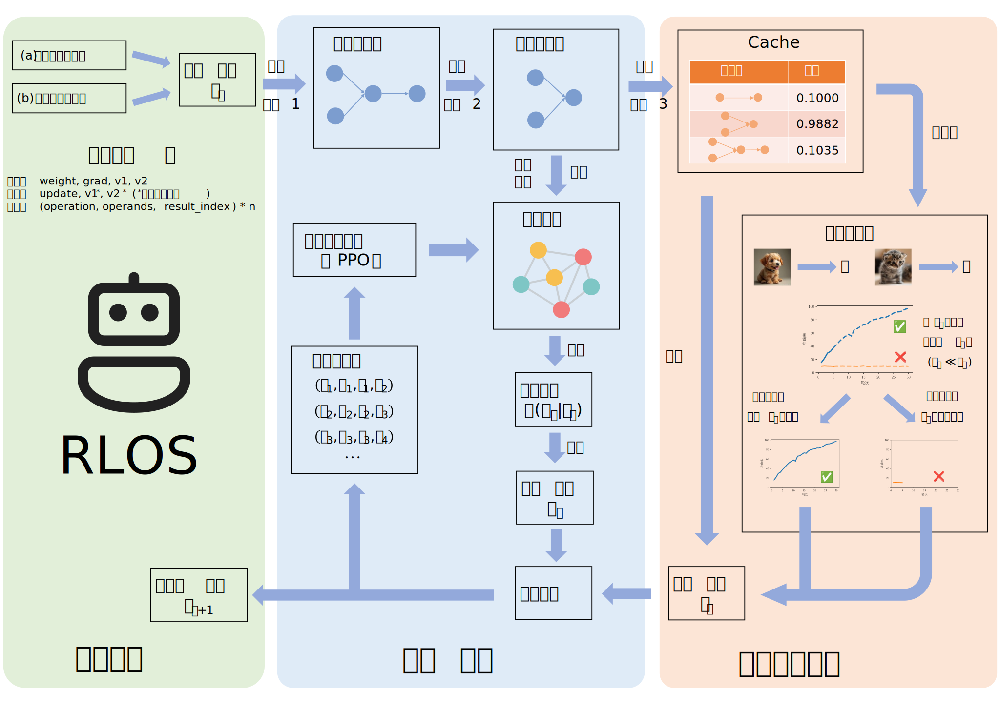

# Reinforcement Learning-based Optimizer Search (RLOS)

## Description

This repository contains the implementation of **RLOS (Reinforcement Learning-based Optimizer Search)**, a novel framework that leverages reinforcement learning to efficiently discover interpretable and general-purpose optimization algorithms for deep learning. By automating the design process, RLOS significantly reduces computational costs, achieving an average search time of just **17.19 GPU hours**, which is only **0.048%** of the cost required by traditional evolutionary approaches. The discovered optimizer, **Ligi**, achieves superior performance across diverse tasks, including a **27.2% training speedup** in GPT-2 pretraining, a **0.98% improvement** in Top-1 accuracy on ImageNet classification, and a **65.7% increase in rewards** in reinforcement learning tasks. The outline of the project is shown below:




## File Overview
- Subfolder `predictors`: Mainly forked from [NASLib](https://github.com/automl/naslib), in which we apply the LCE predictor here. Other predictors from this library can be readily copied and modified to suit for our project.
- `cache.py`: Build the cache for fast evaluation. When the cache hits, the current reward immediately returns, saving the time for running CIFAR-10 pipeline. It also implements the utility functions, including the `clean_cache` function that remove duplicate items, and `merge_and_reindex` if you have two cache files on two different machines.
- `env.py`: Implement a custom environment `RLSearchEnv` following the Gymnasium interface. It defines the observation (state) space, the action space, the `step` function of checking the validity and apply the action as well as computing the reward, and several utility functions including the conversion between the observations and update rules.
- `eval.py`: The inference script. Once the RLOS agent is fully trained, it initializes with the program text of known optimizers (e.g., AdamW, Lion, etc.) as a starting point. The RLOS agent then iteratively modifies the optimizer's update rules during the evaluation episode, using its learned policy to refine the optimizer design.
- `globals.py`: Defines the global variables and params.
- `graph.py`: Creates the `ComputationalGraph` class with a constructor function from the update rule, `refine` function to remove redundant parts, a `draw` function to visualize the graph, and an overrided `==` operator to compare two graphs to see if they are logically the same based on graph isomorphism. Also implements the graph embedding class which converts the `ComputationalGraph` object to PyTorch Geometric embedding data.
- `ligi.py`: Contains the PyTorch implementation of the found Ligi optimizer.
- `main.py`: The entry for running the code.
- `optim.py`: Build the PyTorch optimizer based on the update rule.
- `pipeline.py`: A CIFAR-10 training pipeline in which the optimizer is controlled by the update rule, and contains the LCE predictor of fast evaluation.
- `policy_nets.py`: Implements the policy network. Containing Graph Attention Network, Pathfinder Discovery Network, and a non-GNN baseline that is default supported by RLLib.
- `update_rule.py`: Defines the basic data structure of the update rule, as well as its generation, visualization, and some associated utility functions and global variables.


## Installation
Please follow these steps:
1. Clone the repository:
```bash
git clone https://github.com/adonis-dym/Reinforcement-Learning-Optimizer-Search.git
```
2. Create a new environment:
```bash
conda create -n searchenv python=3.8
conda activate searchenv
```
3. Install the dependencies:
```
pip install -r requirements.txt
```
## Usage
1. RLOS first trains the GNN-based agent, starting from randomly initialized programs, by rewarding it for taking actions that elevate performance on the CIFAR-10 training task.

   To start the environment and train the RLOS agent:
   ```python
   python main.py
    ```

    By default, this will distribute the policy network as well as the rollout workers on 2 GPUs. After about 17 hours (**0.048% time** of the previous work), the agent will finish its training phase.

2. After training, RLOS is able to make modifications on the existing optimizer programs. You can either still start randomly same as the training phase, or provide a high-quality starting point that incorporates the structure of existing deep learning optimizers.

    To make inference:
    ```python
    python eval.py
    ```
    The `eval.py` provides the text encoding of the AdamW and Lion optimizers which you may find useful.

## The found Ligi Optimizer

**Initialize:**  $\theta^1, m^0, \beta_1 = 0.9, \beta_2 = 0.99, \gamma = 0.9$

**While** the stopping condition is not met:
1. $c^t \gets \beta_1 \cdot m^{t-1} + (1 - \beta_1) \cdot g^t$

2. $\theta^{t+1} \gets \theta^{t} - \eta \left( \dfrac{{c}^t}{\gamma |{c}^t| + (1 - \gamma) |g^t|} + \lambda \theta^{t} \right)$  

3. $m^t \gets \beta_2 \cdot m^{t-1} + (1 - \beta_2) \cdot g^t$

4. $t \gets t + 1$

**Return:** $\theta^t$

See the file `ligi.py` for its implementation details. You can use it out-of-the-box within PyTorch.
## References
[1] Chen, Xiangning, et al. "Symbolic discovery of optimization algorithms." Advances in neural information processing systems 36 (2024).

[2] Domhan, Tobias, Jost Tobias Springenberg, and Frank Hutter. "Speeding up automatic hyperparameter optimization of deep neural networks by extrapolation of learning curves." Twenty-fourth international joint conference on artificial intelligence. 2015.

[3] White, Colin, Arber Zela, Robin Ru, Yang Liu, and Frank Hutter. "How powerful are performance predictors in neural architecture search?." Advances in Neural Information Processing Systems 34 (2021): 28454-28469.

[4] Chen, Tianlong, et al. "Learning to optimize: A primer and a benchmark." The Journal of Machine Learning Research 23.1 (2022)

[5] White, Colin, et al. "Neural architecture search: Insights from 1000 papers." arXiv preprint arXiv:2301.08727 (2023).
